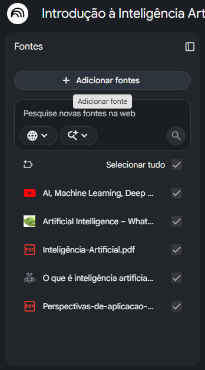
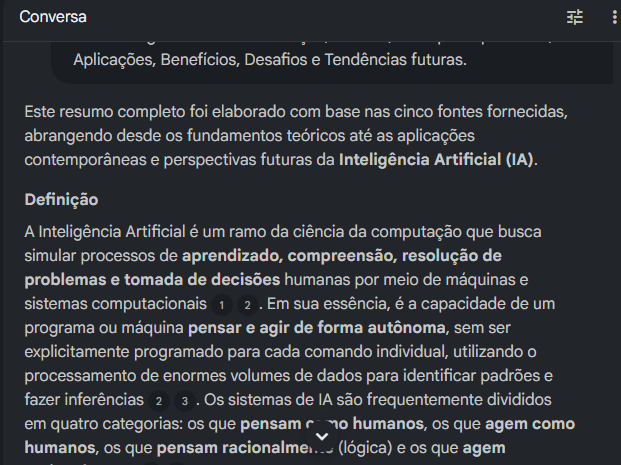
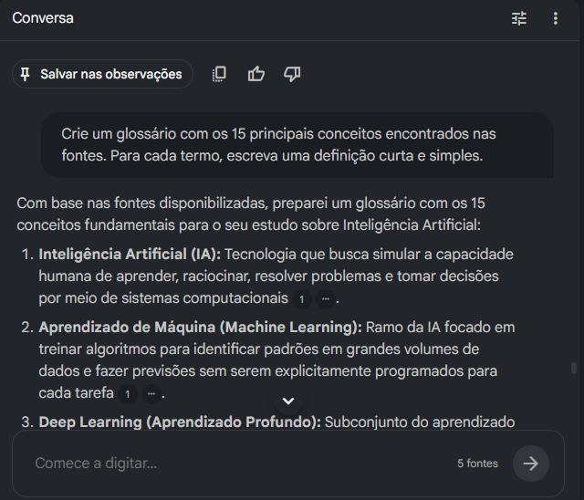
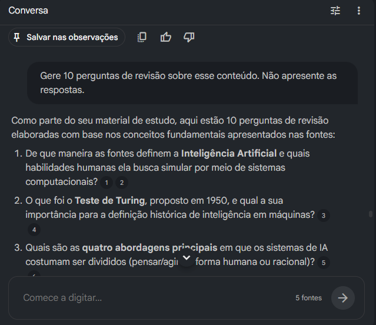

# 📚 Miniguia de Estudos com NotebookLM – Inteligência Artificial

Este projeto foi desenvolvido como parte de um desafio prático utilizando o **NotebookLM**. O objetivo foi criar um caderno temático sobre **Inteligência Artificial**, reunindo fontes confiáveis, explorando recursos da ferramenta e produzindo um material de estudo organizado.

---

## 📑 Índice

- [📖 Contexto](#-contexto)
- [🎯 Objetivos](#-objetivos)
- [📚 Curadoria de Fontes](#-curadoria-de-fontes)
- [💬 Engenharia de Prompts](#-engenharia-de-prompts)
- [🛠️ Cicatrizes (Troubleshooting)](#️-cicatrizes-troubleshooting)
- [📘 Miniguia de Estudos](#-miniguia-de-estudos)
- [📖 Glossário](#-glossário)
- [💡 Prompts Reutilizáveis](#-prompts-reutilizáveis)
- [📷 Capturas de Tela](#-capturas-de-tela)
- [✅ Conclusão](#-conclusão)

---

## 📖 Contexto

Este projeto foi desenvolvido como parte de um desafio prático com o objetivo de explorar o NotebookLM como ferramenta de apoio aos estudos. Para isso, foi criado um caderno temático sobre **Inteligência Artificial (IA)** utilizando fontes confiáveis, como artigos, materiais acadêmicos, documentação técnica e conteúdo audiovisual.

Durante o desenvolvimento do projeto, o NotebookLM foi utilizado para organizar as informações, gerar resumos, construir um glossário, responder perguntas e auxiliar na criação de um material de estudo estruturado.

---

## 🎯 Objetivos

- Compreender os conceitos fundamentais da Inteligência Artificial.
- Identificar os principais tipos de IA e suas características.
- Conhecer aplicações práticas da IA em diferentes áreas.
- Estudar os benefícios, desafios e tendências futuras da tecnologia.
- Explorar o NotebookLM como ferramenta para organização do conhecimento e apoio aos estudos.

---

## 📚 Curadoria de Fontes

Para a construção do caderno temático, foram selecionadas fontes abertas e confiáveis que abordam os fundamentos, aplicações e desafios da Inteligência Artificial.

1. **IBM – O que é Inteligência Artificial?**  
   https://www.ibm.com/br-pt/think/topics/artificial-intelligence

2. **Universidade de Brasília (UnB) – Perspectivas de aplicação de Inteligência Artificial em Arquivos (PDF)**  
   https://arquivistica.fci.unb.br/wp-content/uploads/tainacan-items/476350/961406/Perspectivas-de-aplicacao-de-inteligencia-artificial-em-arquivos.pdf

3. **Universidade Estadual do Ceará (UECE) – Inteligência Artificial (PDF)**  
   https://www.uece.br/cct/wp-content/uploads/sites/28/2021/07/Intelige%CC%82ncia-Artificial.pdf

4. **NVIDIA – Artificial Intelligence Glossary**  
   https://www.nvidia.com/en-sg/glossary/artificial-intelligence/

5. **Vídeo do YouTube sobre Inteligência Artificial**  
   https://www.youtube.com/watch?v=qYNweeDHiyU

---

## 💬 Engenharia de Prompts

Durante o desenvolvimento do projeto, foram utilizados diferentes prompts para explorar os recursos do NotebookLM e transformar as fontes em um material de estudo estruturado.

### Prompt inicial

> Você é um professor especialista em Inteligência Artificial. Utilize apenas as informações presentes nas fontes deste notebook. Responda sempre em português do Brasil, de forma clara e organizada. Sempre que possível, informe em qual fonte a informação foi encontrada.

Esse prompt foi utilizado para definir o contexto da conversa e garantir que as respostas fossem baseadas exclusivamente nas fontes adicionadas ao NotebookLM.

### Prompts utilizados

- O que é Inteligência Artificial? Explique de forma simples, como se eu fosse um estudante iniciante.
- Faça um resumo completo de todas as fontes organizado em tópicos.
- Crie um glossário contendo os 15 principais conceitos encontrados nas fontes.
- Explique as diferenças entre Inteligência Artificial, Machine Learning, Deep Learning e IA Generativa.
- Quais são as aplicações mais importantes da Inteligência Artificial citadas nas fontes?
- Quais são os principais desafios, limitações e riscos da Inteligência Artificial apresentados nas fontes?
- Gere 10 perguntas de revisão sobre esse conteúdo.
- Responda às perguntas utilizando apenas as informações presentes nas fontes.

---

## 🛠️ Cicatrizes (Troubleshooting)

Durante a utilização do NotebookLM, alguns aprendizados importantes foram observados:

- No primeiro prompt, foi definido que todas as respostas deveriam ser apresentadas em português do Brasil, de forma clara e organizada. Isso ajudou a manter um padrão durante toda a conversa.
- Também foi solicitado que a ferramenta utilizasse apenas as informações presentes nas fontes adicionadas ao notebook. Apesar de o NotebookLM naturalmente priorizar essas fontes, essa instrução tornou o objetivo das consultas mais explícito.
- As respostas apresentaram referências às fontes utilizadas, facilitando a verificação das informações e aumentando a confiabilidade do material produzido.
- Não foi necessário reformular os prompts durante o desenvolvimento, pois as respostas atenderam às expectativas desde as primeiras consultas.
- A principal lição aprendida foi que prompts objetivos e bem contextualizados geram respostas mais organizadas e adequadas para a criação de materiais de estudo.

---

## 📘 Miniguia de Estudos

### 🤖 O que é Inteligência Artificial?

A Inteligência Artificial (IA) é um ramo da Ciência da Computação que busca desenvolver sistemas capazes de simular habilidades humanas, como aprender, raciocinar, resolver problemas e tomar decisões. Seu funcionamento é baseado na análise de grandes volumes de dados para identificar padrões e gerar respostas ou previsões.

---

### 📜 História

- **1950:** Alan Turing propõe o Teste de Turing para avaliar a inteligência de máquinas.
- **1956:** John McCarthy apresenta oficialmente o termo "Inteligência Artificial".
- **Décadas de 1980 e 1990:** Popularização dos Sistemas Especialistas.
- **Século XXI:** Avanço impulsionado pelo Big Data, aumento do poder computacional e uso de GPUs.
- **Atualidade:** Expansão da IA Generativa e dos Grandes Modelos de Linguagem (LLMs).

---

### 🧠 Principais Tipos de IA

- **Machine Learning:** algoritmos aprendem a partir de dados.
- **Deep Learning:** utiliza redes neurais profundas para resolver problemas complexos.
- **IA Generativa:** cria conteúdos como textos, imagens, vídeos e códigos.
- **IA Restrita (Fraca):** especializada em tarefas específicas.
- **IA Geral (AGI):** conceito teórico de uma IA capaz de realizar qualquer tarefa intelectual humana.

---

### 💼 Aplicações

A Inteligência Artificial está presente em diversas áreas, como:

- Saúde
- Finanças
- Indústria
- Comércio
- Arquivologia
- Robótica
- Assistentes Virtuais
- Desenvolvimento de software

---

### ✅ Benefícios

- Automação de tarefas repetitivas.
- Redução de erros humanos.
- Processamento rápido de grandes volumes de dados.
- Apoio à tomada de decisão.
- Funcionamento contínuo (24 horas por dia).

---

### ⚠️ Desafios

- Viés nos dados.
- Segurança e privacidade.
- Alto custo computacional.
- Falta de transparência em alguns modelos.
- Questões éticas e regulatórias.

---

### 🚀 Tendências Futuras

- IA Agêntica.
- Modelos Multimodais.
- IA Responsável.
- Expansão da IA Generativa.
- Crescimento do impacto econômico da tecnologia.

---

## 📖 Glossário

| Termo | Definição |
|-------|-----------|
| **Inteligência Artificial (IA)** | Tecnologia que busca simular a capacidade humana de aprender, raciocinar, resolver problemas e tomar decisões. |
| **Machine Learning** | Área da IA em que algoritmos aprendem padrões a partir de dados. |
| **Deep Learning** | Subárea do Machine Learning que utiliza redes neurais com múltiplas camadas. |
| **IA Generativa** | Modelos capazes de criar textos, imagens, vídeos, áudios e códigos. |
| **Grandes Modelos de Linguagem (LLMs)** | Modelos treinados em grandes volumes de texto para compreender e gerar linguagem natural. |
| **Agente de IA** | Programa que percebe o ambiente e executa ações para atingir objetivos específicos. |
| **IA Agêntica** | Sistema composto por múltiplos agentes capazes de realizar tarefas complexas de forma autônoma. |
| **Aprendizado Supervisionado** | Método de treinamento utilizando dados previamente rotulados. |
| **Aprendizado Não Supervisionado** | Método que identifica padrões em dados sem rótulos. |
| **Aprendizado por Reforço** | Aprendizado baseado em tentativa e erro utilizando recompensas e penalidades. |
| **Redes Neurais Artificiais** | Modelos computacionais inspirados no funcionamento dos neurônios humanos. |
| **Processamento de Linguagem Natural (PLN)** | Área da IA dedicada à compreensão e geração da linguagem humana. |
| **Teste de Turing** | Método proposto por Alan Turing para avaliar se uma máquina demonstra comportamento inteligente semelhante ao humano. |
| **Modelos de Fundação** | Modelos de IA treinados em grande escala e adaptáveis para diversas tarefas. |
| **Ética e Governança de IA** | Conjunto de princípios que busca garantir uma IA segura, transparente e responsável. |

---

## 💡 Prompts Reutilizáveis

Os prompts abaixo podem ser reutilizados em qualquer notebook para facilitar os estudos:

### 📚 Resumo

> Faça um resumo organizado em tópicos utilizando apenas as informações presentes nas fontes.

### 👨‍🏫 Explicação simples

> Explique este assunto como se eu fosse um estudante iniciante.

### 📖 Glossário

> Crie um glossário com os principais conceitos encontrados nas fontes.

### ⚖️ Comparação

> Compare os principais conceitos apresentados nas fontes e destaque suas diferenças.

### 📝 Revisão

> Gere 10 perguntas de revisão sobre este conteúdo sem apresentar as respostas.

### ✅ Correção

> Agora responda às perguntas utilizando apenas as informações presentes nas fontes.

### 📄 Resumo executivo

> Produza um resumo executivo em até uma página.

### 🎓 Preparação para prova

> Quais são os tópicos mais importantes que preciso estudar para uma prova sobre este assunto?

---

## 📷 Capturas de Tela

### Fontes carregadas no NotebookLM

---

### Resumo gerado pelo NotebookLM

---

### Glossário

---

### Perguntas de revisão

---

## ✅ Conclusão

*Em construção.*
